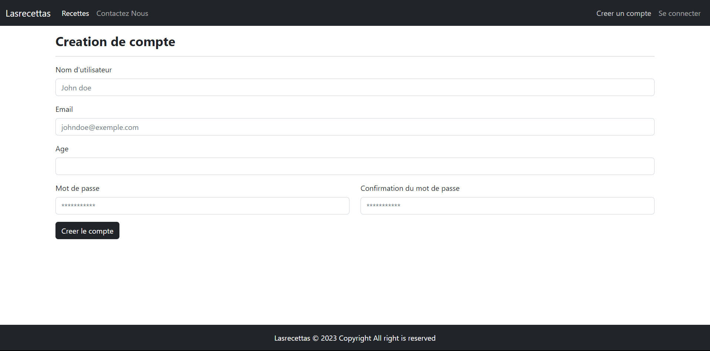

# Application de Recettes : Lasrecettas

Cette application de recettes permet aux utilisateurs de créer des comptes, de se connecter, de visualiser des recettes, de les noter, de les commenter et de les gérer.

## Fonctionnalités principales

- **Création de compte :** Les utilisateurs peuvent créer un compte en fournissant leur nom, leur adresse e-mail et leur mot de passe.

- **Connexion :** Les utilisateurs enregistrés peuvent se connecter à leur compte à l'aide de leur adresse e-mail et de leur mot de passe.

- **Visualisation des recettes :** Les utilisateurs peuvent parcourir les recettes disponibles et voir les détails de chaque recette, y compris le titre, la description, les ingrédients, les étapes de préparation, etc.

- **Notation des recettes :** Les utilisateurs peuvent attribuer une note à une recette en fonction de leur appréciation. La note moyenne de chaque recette est calculée et affichée.

- **Commentaires :** Les utilisateurs peuvent commenter les recettes et partager leurs impressions, astuces ou suggestions avec la communauté.

- **Gestion des recettes :** Les administrateurs du site peuvent gérer les recettes, y compris l'ajout, la modification et la suppression de recettes.

## Installation

1. Clonez le dépôt GitHub de l'application de recettes sur votre machine locale.
```bash
git clone https://github.com/votre-utilisateur/nom-du-depot.git
```

2. Configurez un serveur web local (par exemple, Apache) et un serveur de base de données (par exemple, MySQL).

3. Importez le schéma de base de données fourni dans votre serveur de base de données.

4. Configurez les informations de connexion à la base de données dans le fichier de configuration approprié.

5. Démarrez votre serveur web local et accédez à l'application de recettes dans votre navigateur.

## Configuration

Dans le fichier de configuration de l'application, vous pouvez définir les paramètres suivants :

- **Informations de connexion à la base de données :** Configurez l'hôte, le nom d'utilisateur, le mot de passe et le nom de la base de données pour établir la connexion à votre serveur de base de données.

- **Options de sécurité :** Configurez des options de sécurité telles que la longueur minimale du mot de passe, l'utilisation de hachage pour stocker les mots de passe, etc.

- **Options d'administration :** Configurez des options spécifiques aux administrateurs du site, telles que les rôles d'administration, les autorisations d'accès, etc.


## Captures





## Contribuer

Toute contribution à cette application de recettes est la bienvenue ! Si vous souhaitez apporter des améliorations, des corrections de bugs ou des nouvelles fonctionnalités, veuillez soumettre une demande de pull avec vos modifications.

## Licence

Cette application de recettes est distribuée sous la licence [MIT](https://opensource.org/licenses/MIT).


